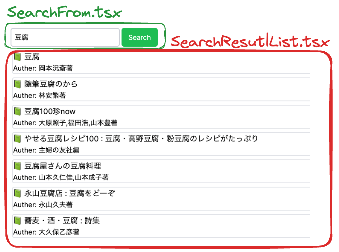
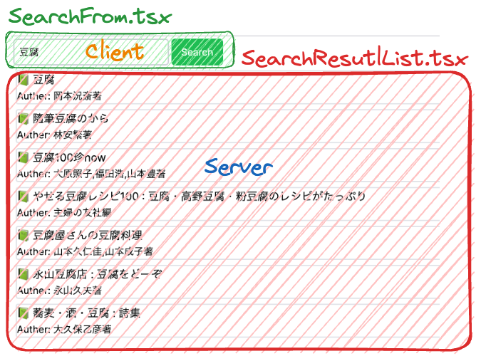

This is examples of state share between client component and server component.
There are two examples, query parameter and cookie implementation.

## book search demo




## Getting Started

First, run the development server:

```bash
npm run dev
```

Open [http://localhost:3000](http://localhost:3000) with your browser to see the result.
